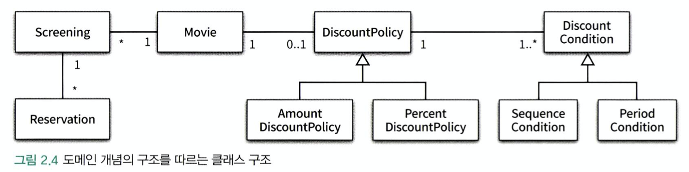
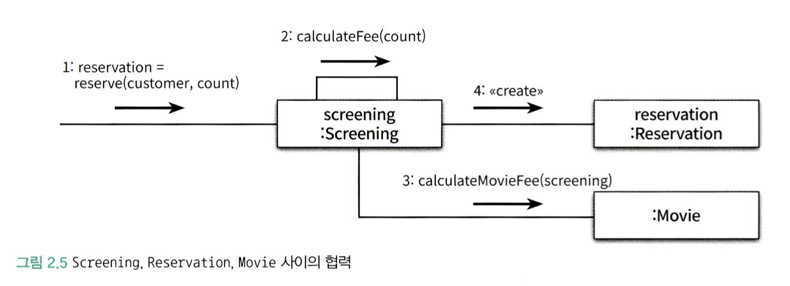
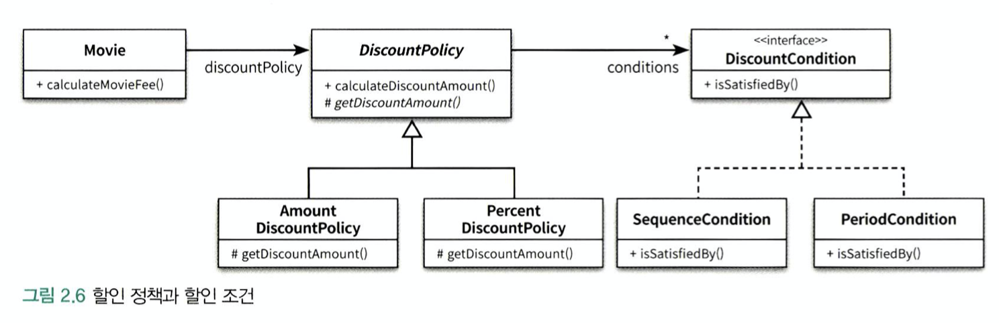

# 객체지향 프로그래

## 01 영화 예매 시스템

### 요구사항 살펴보기

- 영화 : 영화에 대한 기본 정보를 표현
- 상영 : 실제로 관객들이 영화를 관람하는 사건을 표현
- 할인 : 할인 조건(discount condition), 할인 정책(discount policy)

**할인조건**  

가격의 할인 여부를 걸졍하며 '순서 조건'과 '기간 조건'의 두 종류가 있다.

**할인정책**  

할인 요금을 결정한다. 여기에는 '금액 할인 정책(amount discount policy)'과 '비율 할인 정책(percent discount policy)'이 있다.

- 영화별로 하나의 할인 정책만 할당할 수 있다.
- 할인 조건은 다수의 할인 조건을 함께 지정할 수 있으며, 순서 조건과 기간 조건을 섞는 것도 가능하다.
- 사용자가 예매를 완료하면 시스템은 예매 정보를 생성한다.

**예매정보**  

제목, 상영정보, 인원, 정가, 결제금액이 포함된다.

## 02 객체지향 프로그램을 향해

### 협력, 객체, 클래스

대부분의 사람들은 클래스를 결정한 후에 클래스에 어떤 속성과 메서드가 필요한지 고민한다. 하지만 이것은 객체지향의 본질과는 거리가 멀다.
진정한 객체지향 패러다임으로의 전환은 클래스가 아닌 객체에 초점을 맞출 때에만 얻을 수 있다. 이를 위해 다음 두 가지에 집중해야 한다.

1. 어떤 클래스가 필요한지를 고민하기 전에 어떤 객체들이 필요한지 고민하다.
2. 객체를 독립적인 재가 아니라 기능을 구현하기 위해 협력하는 공동체의 일원으로 봐야 한다. 

### 도메인 구조를 따르는 프로그램 구조

문제를 해결하기 위해 사용자가 프로그램을 사용하는 분야를 도메인이라고 부른다.

### 클래스 구현하기

클래스의 내부와 외부를 구분해야 하는 이유는 무엇일까? 그 이유는 경게의 명확성이 개체의 자율성을 보장하기 떄문인다. 
그리고 더 중요한 이유로 프로그래머에게 구현의 자유를 제공하기 때문인다.

#### 자율적인 객체

두 가지 중요한 사실을 알아야 한다.

1. 객체가 상태(state)와 행동(behavior)을 함께 가지는 복합적인 존재라는 것이다.
2. 객체가 스스로 판단하고 행동하는 자율적인 존재라는 것이다.

- 객체지향 이전의 패러다임에서는 데이터와 기능이라는 독립적인 존재를 서로 엮어 프로그램을 구성했다. 이와 달리 객체지향은 객체라는 단위 안에 데이터와 기능을 한 덩어리로 묶음으로써 문제 영역의 아이디어를 적절하게 표현할 수 있게 했다.
이처럼 데이터와 기능을 개체 내부로 함께 묶는 것을 캡슐화라고 부른다.

- 객체 내부에 대한 접근을 통제하는 일은 객체를 자율적인 존재로 만들기 위해서다. 외부에서는 객체가 어떤 상태에 놓여 있는지, 어떤 생각을 하고 있는지 알아서는 안되며, 결정에 직접적으로 개입하려고 해서도 안된다.

 **캡슐화와 접근 제어**  
 
 1. 외부에서 접근 가능한 부분으로 이를 퍼블릭 인터페이스라고 부른다.
 2. 외부에서는 접근 불가능하고 오직 내부에서만 접근 가능한 부분으로 이를 구현이라고 부른다.
 
인터페이스와 구현의 분리(separation of interface and implementation) 원칙은 훌륭한 객체지향 프로그램을 만들기 위해 따라야 하는 핵심 원칙이다. 일반적으로 객체의 상태는 숨기고 행동만 외부에 공개해야 한다.
 
#### 프로그래머의 자유

- 클래스 작성자(class creator) : 새로운 데이터 타입을 프로그램에 추가 -> 필요한 부분만 공개하고 나머지는 꽁꽁 숨겨 구현 은닉을 해야한다.
- 클라이언트 프로그래머(client programmer) : 클래스 작성자가 추가한 데이터 타입을 사용 -> 필요한 클래스들을 엮어서 애플리케이션을 빠르고 안정적으로 구축해야 한다.

설계가 필요한 이유는 변경을 관리하기 위해서라는 것을 기억하라. 

### 협력하는 객체들의 공동체

객체지향의 장점은 객체를 이용해 도메인의 의미를 풍하게 표현할 수 있다는 것이다. 따라서 의미를 좀 더 명시적이고 분명하게 표현할 수 있다면 객체를 사용해서 해당 개념을 구현하라.
그 개념이 비록 하나의 인스턴스 변수만 포함하더라도 개념을 명시적으로 표현하는 것은 전체적인 설계의 명확성과 유연성을 높이는 첫걸음이다.

### 협력에 관한 짧은 이야기

- 객체가 다른 객체와 상호작용할 수 있는 유일한 방법은 **메시지를 전송** 하는 것뿐이다.
- 다른 객체에게 요청이 도착할 때 해당 객체가 **메시지를 수신** 했다고 이야기 한다.
- 수신된 메시지를 처리하기 위한 자신만의 방법을 **메서드**라고 부른다.

메시지와 메서드를 구분하는 것은 매우 중요하다.

## 03 할인요금 구하기

### 할인 정책과 할인 조건

부모 클래스에 기본적인 알고리즘의 흐름을 구현하고 중간에 필요한 처리를 자식 클래스에게 위임하는 디자인 패턴을 TEMPLATE METHOD 패턴이라고 부른다.

### 할인 정책 구성하기

생성자의 파라미터 목록을 이용해 초기화에 필요한 정보를 전달하도록 강제하면 올바른 상태를 가진 객체의 생성을 보장할 수 있다.

## 04 상속와 다형성

### 컴파일 시간 의존성과 실행 시간 의존성

- 코드의 의존성과 실행 시점의 의존성이 서로 다를 수 있다. 여기서 한 가지 간과해서는 안 되는 사실은 코드의 의존성과 실행 시점의 의존성이 다르면 다를수록 코드를 이해하기 어려워진다는 것이다.
반면 코드의 의존성과 실행 시점의 의존성이 다르면 다를수록 코드는 더 유연해지고 확장 가능해진다. 이와 같은 의존성의 양면성은 설게가 트레이드오프의 산물이라는 사실을 잘 보여준다.

- 설계가 유연해질수록 코드를 이해하고 디버깅하기는 점점 더 어려워진다는 사실을 기억하라. 반면 유연성을 억제하면 코드를 이해하고 디버깅하기는 쉬워지지만 재사용성과 확장 가능성은 낮아진다는 사실도 기억하라.

### 차이에 의한 프로그래밍

상속은 객체지향에서 코드를 재사용하기 위해 가장 널리 사용되는 방법이다. 부모 클래스와 다른 부분만을 추가해서 새로운 클래스를 쉽고 빠르게 만드는 방법을 차이에 의한 프로그래밍(programming by difference)이라고 부른다.

### 상속과 인터페이스

- 상속이 가치 있는 이유는 부모 클래스가 제공하는 모든 인터페이스를 자식 클래스가 물려받을 수 있기 때문이다.
- 상속의 목적이 메서드나 인스턴스 변수를 재사용하는 것이라고 생각하는 인식과는 거리가 있다.
- 상속을 통해 자식 클래스는 자신의 인터페이스에 부모 클래스의 인터페이스를 포함하게 된다. 결과적으로 자식 클래스는 부모 클래스가 수신할 수 있는 모든 메시지를 수신할 수 있기 때문에 외부 객체는 자식 클래스를 부모 클래스와 동일한 타입으로 간주할 수 있다.

### 다형성

- 다형성은 객체지향 프로그램의 컴파일 시간 의존성과 실행 시간 의존성이 다를 수 있다는 사실을 기반으로 한다.
- 다형성은 컴파일 시간 의존성과 실행 시간 의존성을 다르게 만들 수 있는 객체지향의 특성을 이용해 서로 다른 메서드를 실행할 수 있게 한다.
- 다형성이란 동일한 메시지를 수신했을 때 객체의 타입에 따라 다르게 응답할 수 있는 능력을 의미한다.
- 상속을 이용하면 동일한 인터페이스를 공유하는 클래스들을 하나의 타입 계층으로 묶을 수 있다.

### 인터페이스와 다형성

추상클래스로 구현함으로써 자식 클래스들이 인터페이스와 내부 구현을 함께 상속받도록 할 수 있다. 그러나 종종 구현은 공유할 필요가 없고 순수하게 인터페이스만 공유하고 싶을 경우 인터페이스라는 프로그래밍 요소를 사용할 수 있다.

## 05 추상화와 유연성

### 추상화의 힘

1. 추상화의 계층만 따로 뗴어 놓고 살펴보면 요구사항의 정책을 높은 수준에서 서술할 수 있다. 즉 세부적인 내용을 무시한채 상위 정책을 쉽고 간단하게 표현할 수 있다.
추상화의 이런 특징은 세부사항에 억눌리지 않고 상위 개념만으로도 도메인의 중요한 개념을 설명할 수 있게 한다.

2. 추상화를 이용하면 설계가 좀 더 유연해 진다. 추상화를 이용해 상위 정책을 표현하면 기존 구조를 수정하지 않고도 새로운 기능을 쉽게 추가하고 확장할 수 있다. 

### 유연한 설계

책임의 위치를 결정하기 위해 조건문을 사용하는 것은 협력의 설계 측면에서 대부분의 경우 좋지 않은 선택이다. 항상 예외 케이스를 최소화하고 일관성을 유지할 수 있는 방법을 선택하라.

### 추상 클래스와 인터페이스 트레이드오프

구현과 관련된 모든 것들이 트레이드오프의 대상이 될 수 있다는 사실이다. 여러분이 작성하는 모든 코드에는 합당한 이유가 있어야 한다.
비록 아주 사소한 결정이더라도 트레이드오프를 통해 얻어진 결론과 그렇지 않은 결론 사이의 차이는 크다. 고민하고 트레이드오프하라.

### 코드 재사용

코드 재사용을 위해서는 상속보다는 합성(composition)이 더 좋은 방법이다. 합성은 다른 객체의 인스턴스를 자신의 인스턴스 변수로 포함해서 재사용하는 방법을 말한다.

### 상속

상속은 두 가지 관점에서 설게에 안 좋은 영향을 미친다.

1. 상속이 캡슐화를 위한다는 것
2. 설계를 유연하지 못하게 만든다는 것

### 합성

- 인터페이스에 정의된 메시지를 통해서만 코드를 재사용하는 방법을 합성이라고 부른다.
- 인터페이스에 정의된 메시지를 통해서만 재사용이 가능하기 때문에 구현을 효과적으로 캡슐화할 수 았다.
- 의존하는 인스턴스를 교체하는 것이 비교적 쉽기 때문에 설계를 유연하게 만든다.
- 상속은 클래스를 통해 강하게 결합되는데 비해 합성은 메시지를 통해 느슨하게 결합된다. 따라서 코드 재사용을 위해서는 상속보다는 합성을 선호하는 것이 더 좋은 방법이다.
